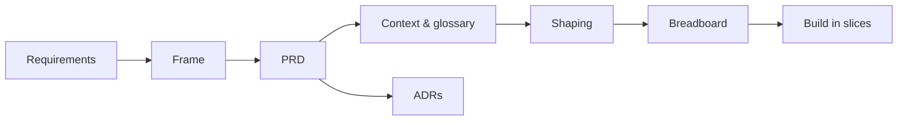

# Pandan — internal docs map

This file is the map of the **contributor-facing** docs in this folder: the decision records that
explain *why* the system is shaped the way it is, and the Shape Up planning chain behind each
milestone.

> **Looking for how to *use* Pandan?** That is a separate, published site built from
> [`docs/guide/`](guide/index.md):
> **<https://leejianrong.github.io/pandan/>**
>
> Installing the CLI, minting a token, using the board, keyboard shortcuts, wiring the MCP server,
> and self-hosting all live there. Nothing in *this* folder outside `guide/` is published.

## What is published, and what is not

`zensical.toml` sets `docs_dir = "docs/guide"`, so the documentation site is built from that subtree
alone. Zensical has no `exclude_docs` option, and its `nav` only controls what is *listed*, so every
file under `docs_dir` ships as a reachable page. Pointing `docs_dir` at the subtree is what actually
keeps the planning trail off the public site.

| Path | Published? | What it is |
| --- | --- | --- |
| `docs/guide/**` | **Yes** | User documentation. The site. |
| `docs/adr/**` | No | Architecture decision records. |
| `docs/REQS,FRAME,PRD,CONTEXT,SHAPING,BREADBOARD.md` | No | The Shape Up chain. |
| `docs/milestone-*/**` | No | Per-milestone frame → shaping → breadboard → slices, session prompts, UAT logs. |
| `docs/guides/**` | No | Internal ops and testing how-tos. |
| `docs/agent-pm-dogfooding-log.md` | No | Running log of driving this board as an agent PM. |
| `docs/blog/`, `docs/superpowers/`, `docs/kaya-vision.md` | No | Writing and adjacent planning. |

If you add a page to `docs/guide/`, add it to the `nav` in `zensical.toml` too. An unlisted file
still builds, so it would ship as an orphan page nothing links to.

## Start here (contributors)

- **New to the codebase?** Read the [context and glossary](CONTEXT.md) for the domain model and the
  exact terms used everywhere else, then skim the
  [architecture decisions](adr/0001-tech-stack-and-monorepo.md).
- **Working on it day to day?** [Developer workflows](DEVELOPER-WORKFLOWS.md) covers the branch, PR,
  worktree and deploy machinery. `CLAUDE.md` at the repo root is the agent brief.
- **Where is the work tracked?** The project dogfoods itself: the *Pandan Roadmap* board on the
  deployed instance is the authoritative task list, plus
  [`docs/milestone-8/SLICES.md`](milestone-8/SLICES.md) for the current milestone.

## How the docs fit together

This is a Shape Up project, and the docs are a deliberate chain rather than scratch notes. Each
document feeds the next:

- **[Shape Up chain](REQS.md)** — the raw ask (`REQS`), narrowed to a `FRAME`, written up as a
  `PRD`, grounded in a shared `CONTEXT`, then shaped into a solution (`SHAPING`) and wired as a
  `BREADBOARD` of UI places before any code is built.
- **[Architecture decisions](adr/0001-tech-stack-and-monorepo.md)** — nineteen numbered ADRs
  capturing each load-bearing choice, its alternatives, and the trade-off, from the tech stack
  (0001) through board authorization (0013), MCP board-scoping (0015), observability (0017), the
  `pandan` rebrand (0018), and MCP surface right-sizing (0019).
- **Milestones** — the core board plus [Milestone 2](milestone-2/SLICES.md) (agent task tracking:
  epics, API versioning, a query API, token auth, and an MCP server),
  [Milestone 3](milestone-3/SLICES.md) (accounts, multi-board with ownership, board authorization,
  and self-serve agent tokens), [Milestone 5](milestone-5/SLICES.md) (agent/human handoff, awareness
  UI, fleet reporting), [Milestone 6](milestone-6/SLICES.md) (abuse hardening, projects, cycles,
  design system, notifications), [Milestone 7](milestone-7/SLICES.md) (the `pandan` rebrand +
  agent-ergonomic CLI) and [Milestone 8](milestone-8/SLICES.md) (board-local ticket refs, sprint
  and backlog tooling, epic/label colour), each planned with its own frame → shaping →
  breadboard → slices.
- **[Internal guides](guides/autosync-github-setup.md)** — ops and testing how-tos that are not user
  documentation: auto-sync setup and operations, running the end-to-end tests behind auth, and edge
  hardening.

!!! note "The code is the source of truth"

    These docs describe intent. Where a documented detail and the source disagree, the source wins —
    check the repository at
    [github.com/leejianrong/pandan](https://github.com/leejianrong/pandan).
